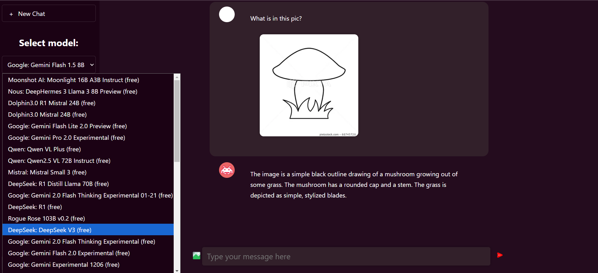
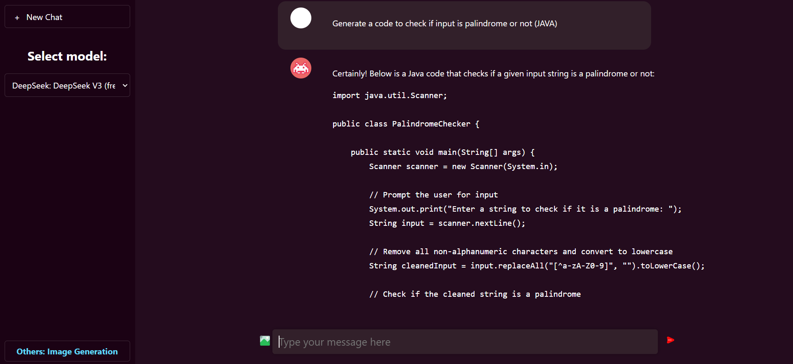
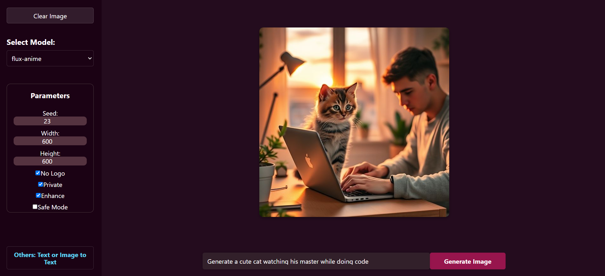

# Real-time AI Chat App 🤖💬

This is a real-time AI chat application that offers various options to select different AI models to generate text and images based on user input. It allows users to interact with different models and upload images, with the added functionality of generating images based on prompts. These models will be updated with APIs to the latest models available until today. (eg. **DeepSeek, Google Gemini 2.0, GPT-4o mini, and many more...**)

## Features: 🚀
- **Chat with AI Models**: Select from available AI models to generate responses.
- **Image Uploads**: Upload images that can be included in your chat.
- **Image Generation**: Generate images based on prompts.
- **Markdown Rendering**: Display messages with Markdown formatting.

## Technologies Used: 🛠️
- **Frontend**: React, ImageKit, React Router
- **Backend**: Express, OpenRouter API, Pollination AI API, ImageKit
- **Environment Variables**: dotenv for managing sensitive information

---

## Setup 📝

### Prerequisites: ⚙️
- Node.js and npm installed on your system.
- A `.env` file with the necessary API keys (see below).

### 1. Clone the Repository

```bash
git clone https://github.com/dhanarajrk/MoonKnight.AI.git
cd MoonKnight.AI
```

### 2. Setup Server (Backend) 🔧

1. The backend is included in the root folder. Ensure you have the following `.env` file in the root folder with the necessary environment variables:

```env
OPENROUTER_API_KEY=your_openrouter_api_key
POLLINATION_API_KEY=your_pollination_api_key
IMAGE_KIT_ENDPOINT=your_imagekit_endpoint
IMAGE_KIT_PUBLIC_KEY=your_imagekit_public_key
IMAGE_KIT_PRIVATE_KEY=your_imagekit_private_key
CLIENT_URL=http://localhost:3000  # or the URL of your frontend
```

2. Since the backend dependencies are already uploaded in the `node_modules` folder, you can skip the `npm install` for the server.

3. Start the server:

```bash
npm run devStart
```

The server will run on `http://localhost:3080`.

---

### 3. Setup Client (Frontend) 🌐

1. Navigate to the `client` folder:

```bash
cd client
```

2. Install client-side dependencies:

```bash
npm install
```

3. Create a `.env` file in the `client` folder with the following content:

```env
REACT_APP_IMAGE_KIT_ENDPOINT=your_imagekit_endpoint
REACT_APP_IMAGE_KIT_PUBLIC_KEY=your_imagekit_public_key
```

4. Start the client:

```bash
npm start
```

The frontend will run on `http://localhost:3000`.

---

## Screenshots 📸

Here are two screenshots showcasing the features of the application:

### **Model Selection Feature** 📝


### 2. **Text Generation Feature** 🖼️


### 2. **Image Generation Feature** 🖼️


---
